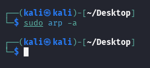
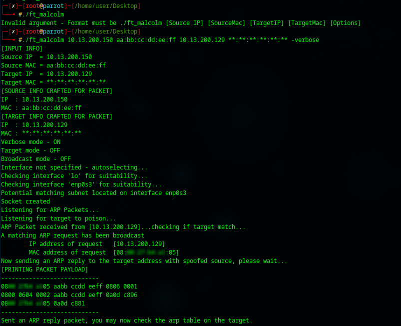
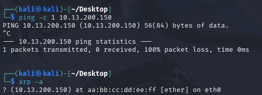

# ft_malcolm

ARP Poisoning Software as part of Ecole 42's Outer Circle project.

## Description

This ARP poisoning software, in its default mode, listens on a socket for ARP requests. When a request is received, it checks if the target IP and MAC addresses match the specified criteria. It then verifies if the IP address the target is seeking matches the Source IP provided at launch. If a match is found, the program sends an ARP response back to the target with the Source MAC as the address for the Source IP. The program then exits.

## Installation

After cloning the repository, navigate to the project directory and use the following commands as required:

```bash
make        # Build the project
make re     # Rebuild the project
make clean  # Remove unnecessary object files after build
make fclean # Remove object files and binary file
```


## Usage

The program must be launched as root or with sudo permissions.

```bash
sudo ./ft_malcolm [Source IP] [Source MAC] [Target IP] [Target MAC] [Options]
```

- **Source IP**: IP address you want to spoof.
- **Source MAC**: MAC address you want the target to associate with the spoofed IP.
- **Target IP**: IP address of the target device on the network.
- **Target MAC**: MAC address of the target device on the network.

**Note:**
The `[Target MAC]` parameter accepts full or partial wildcards (`*`).

- If you do not know the MAC address of the target, use `**:**:**:**:**:**`.
- For partial knowledge, set wildcards for unknown fields, e.g., `aa:bb:**:dd:**:ff`.

The wildcard does **not** work if you use the `-target` option.

## Options

The program supports the following options:

- `-verbose`
Prints detailed information, including packet information of sent payloads.
- `-target`
Actively sends a crafted ARP packet to the target IP instead of waiting and listening for the target to send a request.
- `-broadcast`
Sends a broadcast ARP packet to all devices on the network, notifying them of the spoofed IP and MAC.
- `-interface <interface name>`
Manually sets the interface to listen and respond from. Must be a valid network interface.


## Tips

- **Linux Security Features:**
By default, Linux has security features that prevent unsolicited ARP responses from being cached. To check if this feature is active, run:

```bash
sudo sysctl net.ipv4.conf.all.arp_accept
```

If the output is `0`, the security feature is active and the target must send a request to process the response. In this case, the `-target` and `-broadcast` options will not work.
To allow your device to accept unsolicited ARP responses, set:

```bash
sudo sysctl net.ipv4.conf.all.arp_accept=1
```

- **Spoofing Existing IPs:**
If you try to spoof an existing IP on the network, the legitimate device may respond before this program does. Linux will process the first packet and ignore subsequent ones, as part of its security measures mentioned in previous point.
- **Self-Poisoning Prevention:**
You cannot poison your own device due to RFC 5227 IP Conflict Detection.
- **Verbose Mode Verification:**
To verify payload printing in verbose mode, run tcpdump while running ft_malcolm:

```bash
sudo tcpdump -i <your_interface_name> -s 0 -xx arp
```


# Demonstration

We will try to poison target 10.13.200.129. We do not know its MAC address so we will use '*' during launch.

We will spoof the IP 10.13.200.150 with fake MAC aa:bb:cc:dd:ee:ff


[TARGET MACHINE BEFORE POISONING]




[HOST MACHINE RUNNING FT_MALCOLM]



[TARGET MACHINE AFTER POISONING]

Note - To force an ARP request, we ping 10.13.200.150




Target machine now thinks 10.129.200.150 is at MAC address aa:bb:cc:dd:ee:ff

